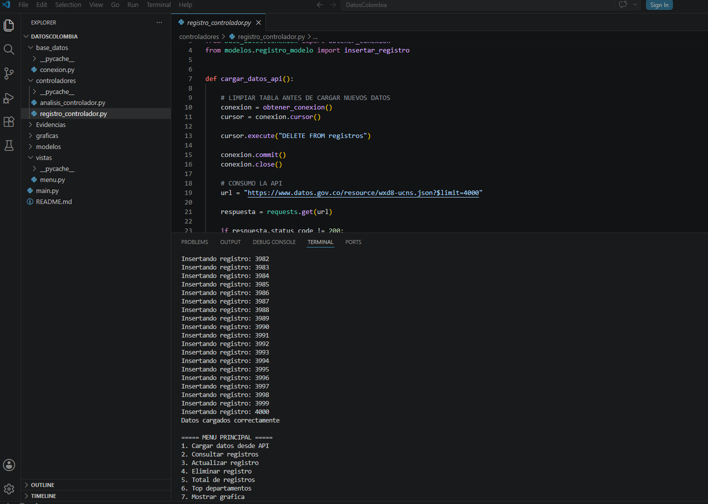
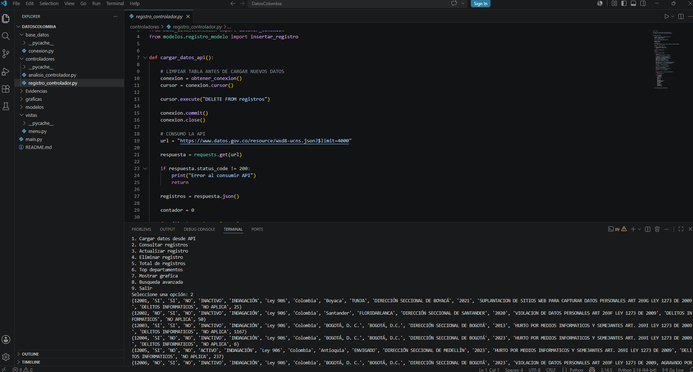
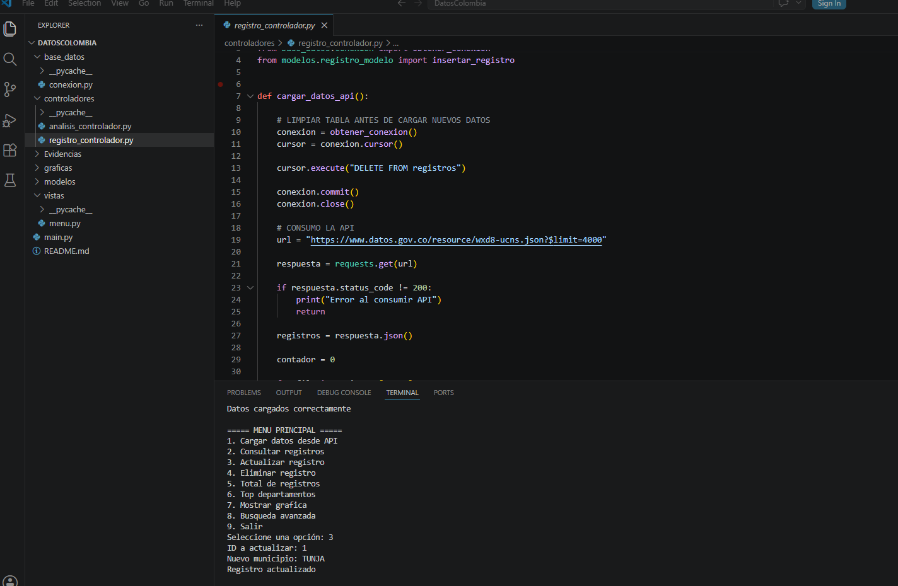
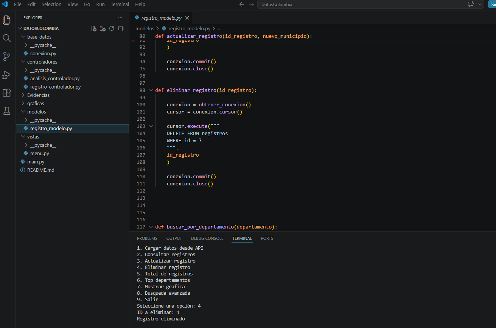
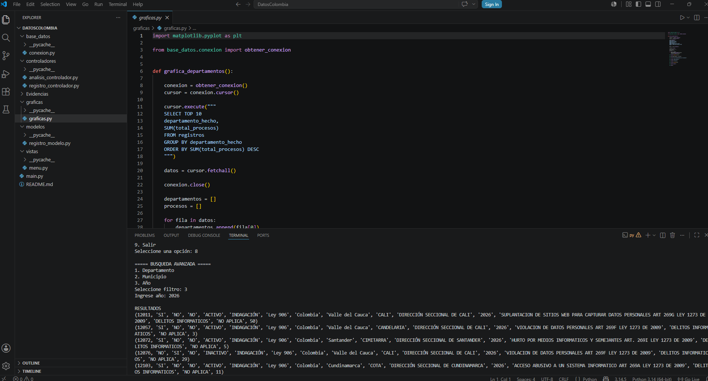
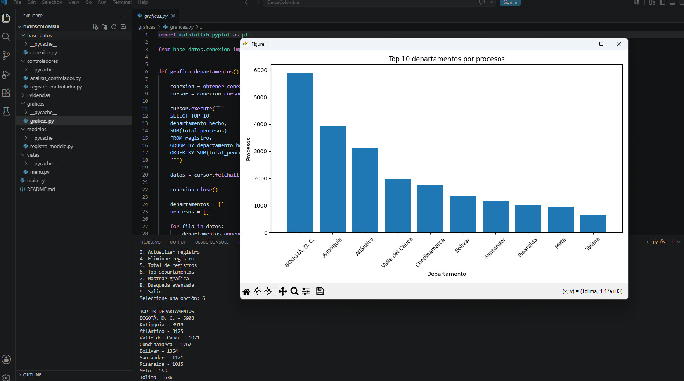

# Proyecto DatosColombia - Delitos Informaticos

## Sistema de Análisis y Gestión de Datos Abiertos de Colombia

### Integrantes

* Jesus Garcia Mendoza
* Keyla Navarro Polo
* Alis Saavedra
* Sebastian Gonzalez

---

## Descripción

Este proyecto consiste en el desarrollo de una aplicación en Python que consume información desde una API pública de Datos Abiertos de Colombia llamada Delitos Informaticos V1, almacena los registros en una base de datos SQL Server y permite realizar operaciones CRUD mediante una interfaz de línea de comandos (CLI).

La aplicación fue desarrollada siguiendo el patrón de arquitectura MVC (Modelo - Vista - Controlador), garantizando una correcta separación de responsabilidades y una mejor organización del código.

---

## Objetivos

* Consumir datos desde una API pública.
* Almacenar la información en una base de datos relacional.
* Implementar operaciones CRUD.
* Aplicar el patrón MVC.
* Realizar análisis de datos.
* Generar visualizaciones gráficas.
* Documentar el proyecto para facilitar su uso y mantenimiento.

------------------------------------------------------------------------------

## Tecnologías Utilizadas

* Python 3.14.5
* Visual Studio Code 
* SQL Server Management Studio 22 
* pyodbc
* requests
* matplotlib
* Patrón MVC
* Git y GitHub

-------------------------------------------------------------------------------

## API Utilizada

Datos Abiertos de Colombia: Delitos informaticos V1

https://www.datos.gov.co/resource/wxd8-ucns.json?$limit=4000

---------------------------------------------------------------------------------

## Patrón MVC Implementado

### Modelo

Contiene las operaciones relacionadas con la base de datos:

* Insertar registros
* Consultar registros
* Actualizar registros
* Eliminar registros
* Búsquedas avanzadas

### Vista

Presenta el menú interactivo al usuario y muestra la información en pantalla.

### Controlador

Gestiona la lógica de negocio y la comunicación entre la vista y el modelo.

-----------------------------------------------------------------------------------

## Funcionalidades

### Cargar datos desde API

Permite obtener los datos desde la API pública e insertarlos en SQL Server.

### Consultar registros

Muestra los registros almacenados en la base de datos.

### Actualizar registros

Permite modificar información existente.

### Eliminar registros

Permite borrar registros de la base de datos.

### Búsqueda avanzada

Permite realizar búsquedas por:

* Departamento
* Municipio
* Año

### Estadísticas

Muestra:

* Total de registros almacenados.
* Top departamentos con mayor cantidad de registros.

### Visualización de datos

Genera gráficas utilizando la librería Matplotlib.

------------------------------------------------------------------------------------

## Instalación

### 1. Clonar el repositorio

git clone https://github.com/Solutech01/DelitosInformaticos.git

### 2. Ingresar al proyecto

cd DatosColombia

### 3. Instalar dependencias

pip install requests

pip install pyodbc

pip install matplotlib

### 4. Configurar SQL Server

Crear la base de datos:

DatosColombia

Crear la tabla:

registros

### 5. Ejecutar el proyecto

py main.py

----------------------------------------------------------------------------------------

## Evidencias

### Carga de Datos desde la API

### Consulta de Registros

### Actualizacion de Registro

### Eliminacion de Registro

### Búsqueda Avanzada

### Top Departamentos y Gráfica Generada

-------------------------------------------------------------------------------------------

## Resultados Obtenidos

La aplicación permitio consumir datos abiertos de Colombia desde la base de datos llamada Delitos Informaticos y almacenarlos en SQL Server, realizar operaciones CRUD, generar estadísticas y visualizar información mediante gráficos, cumpliendo con los requisitos planteados para el proyecto integrador.

----------------------------------------------------------------------------------------------

## Conclusiones

* Aplicamos correctamente el patrón MVC, logrando una adecuada organización y separación de las responsabilidades dentro del proyecto.

* Integramos exitosamente una API pública de Datos Abiertos de Colombia con una base de datos SQL Server para almacenar y gestionar la información obtenida.

* Implementamos las operaciones CRUD (Crear, Consultar, Actualizar y Eliminar), permitiendo administrar los registros de manera eficiente.

* Desarrollamos funcionalidades de análisis y búsqueda avanzada que facilitan la consulta de información según diferentes criterios.

* Generamos visualizaciones gráficas que nos permitieron interpretar y presentar los datos de forma más clara y comprensible.

* Fortalecimos nuestros conocimientos en consumo de APIs, manejo de bases de datos, programación en Python, arquitectura MVC y uso de herramientas de control de versiones como Git y GitHub.

* Cumplimos satisfactoriamente con los objetivos planteados para el proyecto, obteniendo una aplicación funcional, organizada y escalable.

------------------------------------------------------------------------------------------------

## Versión

v1.0 - Entrega Final
